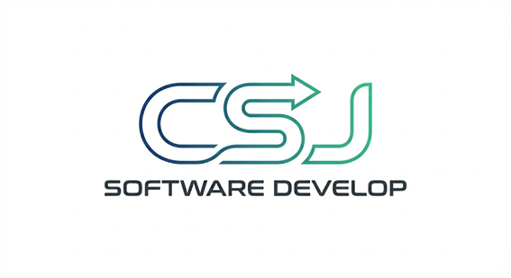
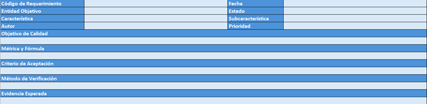
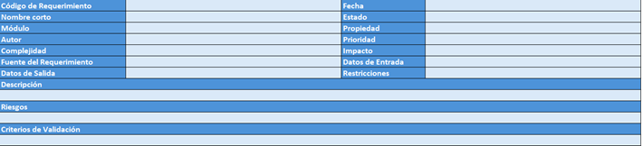

  

## 📑 Tabla de Contenido
1. [Introducción y Propósito](#1-introducción-y-propósito)
2. [Alcance del Manual](#2-alcance-del-manual)
3. [Principios Rectores](#3-principios-rectores)
4. [Modelo de Gobernanza Documental](#4-modelo-de-gobernanza-documental)
   * [4.1 Identificación Única](#41-identificación-única)
   * [4.2 Control de Cambios](#42-control-de-cambios)
   * [4.3 Ciclo de Vida Documental](#43-ciclo-de-vida-documental)
   * [4.4 Almacenamiento](#44-almacenamiento)
5. [Modelo de Roles y Responsabilidades](#5-modelo-de-roles-y-responsabilidades)
6. [Hoja de Ruta (Accesos a PDFs)](#6-hoja-de-ruta-del-ciclo-de-vida-índice-de-documentos)
7. [Política de Calidad (ISO 25010)](#7-política-corporativa-de-calidad-iso-25010)
8. [Estándar Corporativo de Requisitos Funcionales (RF)](#8-estándar-corporativo-de-requisitos-funcionales-rf)
   * [8.1 Estructura Obligatoria](#81-estructura-obligatoria)
   * [8.2 Reglas de Calidad](#82-reglas-de-calidad-para-rf)
   * [8.3 Relación con otros Artefactos](#83-relación-con-otros-artefactos)
9. [Política de Cumplimiento](#9-política-de-cumplimiento-normativo)
10. [Mejora Continua](#10-política-de-mejora-continua)
11. [Métricas (KPIs)](#11-métricas-de-desempeño-kpis)
12. [Matriz de Comunicación](#12-matriz-de-comunicación-del-proyecto)

---

---

# MANUAL DE GESTIÓN DEL CICLO DE VIDA DE SOFTWARE
**Dossier de Ingeniería - CSJ Software Develop**

| Propiedad | Detalle |
| :--- | :--- |
| **Código** | DOC-MST-001 |
| **Estado** | VIGENTE |
| **Clasificación** | INTERNO |
| **Fecha** | 28/01/2026 |
| **Ubicación** | [POR DEFINIR] |
| **Responsable** | Juan Martín Charvet Andrade – Director de Tecnología |

---

## 📋 Historial de Versiones
| Versión | Fecha | Autor | Descripción | Revisado por |
| :--- | :--- | :--- | :--- | :--- |
| 1.0 | 28/01/2026 | Juan Martín Charvet Andrade | Creación inicial del sistema de gestión de ingeniería | Christopher Muzo Trujillo |

## ✅ Aprobación
| Rol | Nombre |
| :--- | :--- |
| **Gerente General** | Christopher Muzo Trujillo |
| **QA Lead** | Said Estefano Soriano Adame |

---

## 1. Introducción y Propósito
El presente Manual establece el marco oficial de ingeniería de **CSJ Software Develop** para la planificación, desarrollo, aseguramiento de calidad, despliegue y mantenimiento de productos de software.

**Este manual adopta como base las siguientes normas:**
* **ISO/IEC 12207:** Procesos del ciclo de vida del software.
* **ISO/IEC 25010:** Modelos de calidad de producto.
* **ISO/IEC/IEEE 29148:** Ingeniería de requisitos.

**Propósitos del documento:**
1.  Estandarizar la forma de trabajo en todos los proyectos.
2.  Garantizar trazabilidad completa desde requisitos hasta producción.
3.  Asegurar que la calidad sea medible, verificable y objetiva.
4.  Facilitar el onboarding de nuevos integrantes.
5.  Permitir auditoría interna y externa.

> **Nota:** Este documento es de cumplimiento obligatorio.

## 2. Alcance del Manual
Este manual aplica a:
* Todos los proyectos desarrollados por CSJ Software Develop (internos y para clientes externos).
* Todos los integrantes del equipo técnico.
* **Terceros proveedores:** Serán incluidos cuando aporten código fuente, infraestructura, componentes críticos o servicios integrados.

## 3. Principios Rectores
CSJ Software Develop opera bajo los siguientes principios:
* Todo trabajo debe estar documentado.
* Todo requisito debe ser verificable.
* Todo cambio debe ser aprobado.
* Ningún código llega a producción sin pruebas.
* La calidad es responsabilidad de todo el equipo.
* La trazabilidad es obligatoria.

---

## 4. Modelo de Gobernanza Documental

### 4.1 Identificación Única
Todos los documentos deben seguir el formato obligatorio: `DOC-[ÁREA]-[NUMERO]`.
* *Ejemplo:* `DOC-REQ-002`.

### 4.2 Control de Cambios
Cada documento debe contener:
* Tabla de historial que incluya versiónes
* Autor
* Revisor
* Fecha
* Descripción

### 4.3 Ciclo de Vida Documental
El flujo de estado de los documentos es:
`Borrador` → `Revisión` → `Aprobado` → `Vigente` → `Obsoleto`.

### 4.4 Almacenamiento
* Repositorio centralizado
* Control de acceso
* Historial de versiones
* Respaldo periódico

---

## 5. Modelo de Roles y Responsabilidades
Definición de la estructura organizativa y responsabilidades técnicas dentro del proyecto.

| Rol | Responsabilidad Principal |
| :--- | :--- |
| **Gerente General** | Dirección estratégica |
| **Director de Tecnología** | Gobierno técnico |
| **Project Manager** | Planificación |
| **Tech Lead** | Arquitectura |
| **QA Lead** | Calidad |
| **Desarrollador** | Implementación |

### Autoridad de Decisiones
* **Cambios de alcance:** Aprobados por el Comité de Cambios.
* **Releases (Lanzamientos):** Autorizados por el QA Lead.
* **Arquitectura:** Definida por el Tech Lead.

---

## 6. Hoja de Ruta del Ciclo de Vida (Índice de Documentos)
Acceso directo a la documentación generada en cada fase del proyecto. Haz clic en los enlaces para visualizar los archivos PDF correspondientes dentro del repositorio.

### 📅 Fase 1: Gestión y Planificación
* [DOC-AGT-001 Contrato Marco](./docs/DOC-AGT-001.pdf)
* [DOC-MAN-001 Guía de Uso del Dossier](./docs/DOC-MAN-001.pdf)
* [DOC-PM-001 Plan de Proyecto](./docs/DOC-PM-001.pdf)
* [DOC-RSK-001 Registro de Riesgos](./docs/DOC-RSK-001.pdf)
* [DOC-CFG-001 Plan de Configuración](./docs/DOC-CFG-001.pdf)
* [DOC-CMP-001 Matriz de Cumplimiento](./docs/DOC-CMP-001.pdf)

### 🚀 Fase 2: Inicio y Requisitos
* [DOC-COM-001 Minuta de Reunión](./docs/DOC-COM-001.pdf)
* [DOC-REQ-001 Análisis de Prefactibilidad](./docs/DOC-REQ-001.pdf)
* [DOC-REQ-002 Especificación de Requisitos (SRS)](./docs/DOC-REQ-002.pdf)
* [DOC-TRZ-001 Matriz de Trazabilidad](./docs/DOC-TRZ-001.pdf)

### 📐 Fase 3: Diseño
* [DOC-ARCH-001 Arquitectura de Software](./docs/DOC-ARCH-001.pdf)
* [DOC-DB-001 Diseño de Base de Datos](./docs/DOC-DB-001.pdf)
* [DOC-MOD-001 Especificación de Modelado UML](./docs/DOC-MOD-001.pdf)

### 💻 Fase 4: Construcción
* [DOC-DEV-001 Estándares de Desarrollo y Codificación](./docs/DOC-DEV-001.pdf)
* [DOC-RPT-001 Informe de Avance del Proyecto](./docs/DOC-RPT-001.pdf)
* [DOC-CHG-001 Solicitud de Control de Cambio](./docs/DOC-CHG-001.pdf)

### 🛡️ Fase 5: Calidad
* [DOC-TEST-002 Casos de Prueba](./docs/DOC-TEST-002.pdf)

### 📦 Fase 6: Despliegue
* [DOC-REL-001 Release Notes](./docs/DOC-REL-001.pdf)
* [DOC-TEC-001 Manual Técnico y de Despliegue](./docs/DOC-TEC-001.pdf)
* [DOC-USR-001 Manual de Usuario Final](./docs/DOC-USR-001.pdf)
* [DOC-CLS-001 Acta de Cierre y Aceptación](./docs/DOC-CLS-001.pdf)

---

## 7. Política Corporativa de Calidad (ISO 25010)
La calidad se gestiona mediante Requisitos No Funcionales (RNF) medibles bajo la norma **ISO/IEC 25010**.

### Estructura de un RNF
Todo requisito no funcional debe incluir los siguientes campos obligatorios:

| Grupo de Datos | Campos Incluidos |
| :--- | :--- |
| **Identificación** | Código, Fecha, Autor, Estado. |
| **Clasificación** | Característica y Sub-característica (ISO 25010). |
| **Validación** | Objetivo de Calidad, Criterio de Aceptación, Método de Verificación y Evidencia Esperada. |

**Prioridades Organizacionales:**
1.  Seguridad.
2.  Performance (Rendimiento).

> **Regla de Oro:** La tolerancia para defectos críticos en producción es **CERO**.

---

## 8. Estándar Corporativo de Requisitos Funcionales (RF)
CSJ Software Develop adopta un estándar ampliado que supera el formato tradicional de "User Story" para asegurar la gestión y el impacto de cada requisito.

### 8.1 Estructura Obligatoria
Todo Requisito Funcional (RF) documentado en el SRS debe cumplir obligatoriamente con la siguiente estructura:

| Campo | Descripción |
| :--- | :--- |
| **Código** | Identificador único del requerimiento. |
| **Nombre Corto** | Título breve y descriptivo. |
| **Prioridad** | Nivel de importancia (Alta, Media, Baja). |
| **Complejidad** | Estimación de la dificultad técnica. |
| **Impacto** | Alcance del cambio en el sistema. |
| **Fuente** | Origen del requerimiento (Cliente, Ley, Sistema). |
| **Criterios de Validación** | Condiciones específicas para aceptar el desarrollo. |

### 8.2 Reglas de Calidad para RF
1.  **No ambigüedad:** Se prohíben descripciones vagas; cada acción debe ser medible.
2.  **Atomicidad:** No se permite mezclar múltiples acciones en un solo código de requerimiento.
3.  **Trazabilidad:** Todo RF debe estar vinculado a un diseño (DOC-ARCH-001) y a un caso de prueba (DOC-TEST-002).

### 8.3 Relación con otros Artefactos
Para garantizar la integridad del sistema, cada Requisito Funcional debe:

* Estar documentado en **DOC-REQ-002**.
* Tener diseño asociado en **DOC-ARCH-001**.
* Tener código asociado vía **PR (Pull Request)**.
* Tener casos de prueba en **DOC-TEST-002**.
* Estar trazado en **DOC-TRZ-001**.

---

## 9. Política de Cumplimiento Normativo
Todo proyecto debe demostrar cumplimiento con las normas establecidas. **El incumplimiento bloquea los releases.**

* **Evidencia ISO 12207:** Ver DOC-CMP-001.
* **Evidencia ISO 25010:** Ver Pruebas de RNF.
* **Evidencia ISO 29148:** Ver SRS (DOC-REQ-002).
---

## 10. Política de Mejora Continua
* Revisión trimestral de procesos.
* Retroalimentación post-proyecto.
* Actualización del manual según lecciones aprendidas.

---

## 11. Métricas de Desempeño (KPIs)
Para garantizar la calidad y eficiencia, se miden los siguientes indicadores:

1.  **Densidad de Defectos:** Número de defectos detectados por módulo antes de la liberación.
    * *Meta:* La tolerancia para defectos críticos en producción es **CERO**.
2.  **Desviación de Cronograma:** Diferencia porcentual entre el tiempo planificado y el real.
    * *Meta:* Desviación máxima permitida de **±10%**.
3.  **Cobertura de Requisitos:** Porcentaje de requisitos que cuentan con evidencia de prueba aprobada.
    * *Meta:* Objetivo del **100%**.

---

## 12. Matriz de Comunicación del Proyecto
Eventos obligatorios para la gestión del proyecto:

| Evento | Frecuencia | Participantes | Entregable Asociado |
| :--- | :--- | :--- | :--- |
| **Daily Sync** | Diaria | Equipo de Desarrollo | Actualización de Trazabilidad. |
| **Revisión de Avance** | Semanal | PM, Tech Lead, QA Lead | Validación de hitos y riesgos. |
| **Reporte de Estado** | Quincenal | PM, Cliente / Sponsor | DOC-RPT-001 Informe de Avance. |
| **Comité de Cambios** | Bajo demanda | PM, Cliente, Tech Lead | DOC-CHG-001 Solicitud de Cambio. |

---

## 8. Estándar Corporativo de Requisitos Funcionales (RF)
CSJ Software Develop adopta un estándar ampliado que supera el formato tradicional de "User Story" para asegurar la gestión y el impacto de cada requisito.

### 8.1 Estructura Obligatoria
Todo Requisito Funcional (RF) documentado en el SRS debe cumplir obligatoriamente con la siguiente estructura:

| Campo | Descripción |
| :--- | :--- |
| **Código** | Identificador único del requerimiento. |
| **Nombre Corto** | Título breve y descriptivo. |
| **Prioridad** | Nivel de importancia (Alta, Media, Baja). |
| **Complejidad** | Estimación de la dificultad técnica. |
| **Impacto** | Alcance del cambio en el sistema. |
| **Fuente** | Origen del requerimiento (Cliente, Ley, Sistema). |
| **Criterios de Validación** | Condiciones específicas para aceptar el desarrollo. |

### 8.2 Reglas de Calidad para RF
1.  **No ambigüedad:** Se prohíben descripciones vagas; cada acción debe ser medible.
2.  **Atomicidad:** No se permite mezclar múltiples acciones en un solo código de requerimiento.
3.  **Trazabilidad:** Todo RF debe estar vinculado a un diseño (DOC-ARCH-001) y a un caso de prueba (DOC-TEST-002).

---

## 9. Política de Cumplimiento Normativo
Todo proyecto debe demostrar cumplimiento con las normas establecidas. **El incumplimiento bloquea los releases.**

* **Evidencia ISO 12207:** Ver DOC-CMP-001.
* **Evidencia ISO 25010:** Ver Pruebas de RNF.
* **Evidencia ISO 29148:** Ver SRS (DOC-REQ-002).

---

## 10. Política de Mejora Continua
* Revisión trimestral de procesos.
* Retroalimentación post-proyecto.
* Actualización del manual según lecciones aprendidas.

---

## 11. Métricas de Desempeño (KPIs)
Para garantizar la calidad y eficiencia, se miden los siguientes indicadores:

1.  **Densidad de Defectos:** Número de defectos detectados por módulo antes de la liberación.
    * *Meta:* La tolerancia para defectos críticos en producción es **CERO**.
2.  **Desviación de Cronograma:** Diferencia porcentual entre el tiempo planificado y el real.
    * *Meta:* Desviación máxima permitida de **±10%**.
3.  **Cobertura de Requisitos:** Porcentaje de requisitos que cuentan con evidencia de prueba aprobada.
    * *Meta:* Objetivo del **100%**.

---

## 12. Matriz de Comunicación del Proyecto
Eventos obligatorios para la gestión del proyecto:

| Evento | Frecuencia | Participantes | Entregable Asociado |
| :--- | :--- | :--- | :--- |
| **Daily Sync** | Diaria | Equipo de Desarrollo | Actualización de Trazabilidad. |
| **Revisión de Avance** | Semanal | PM, Tech Lead, QA Lead | Validación de hitos y riesgos. |
| **Reporte de Estado** | Quincenal | PM, Cliente / Sponsor | DOC-RPT-001 Informe de Avance. |
| **Comité de Cambios** | Bajo demanda | PM, Cliente, Tech Lead | DOC-CHG-001 Solicitud de Cambio. |